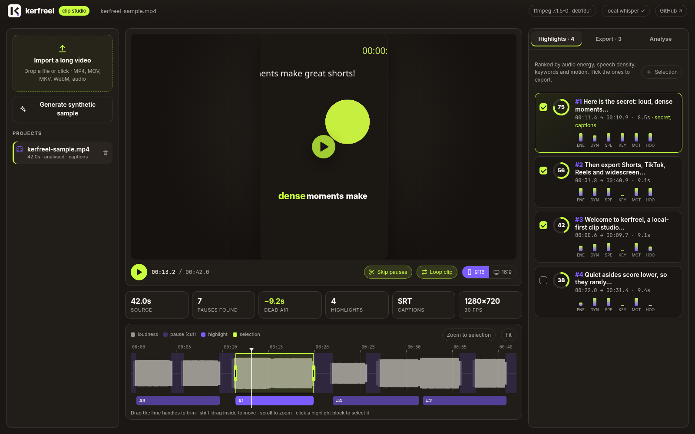
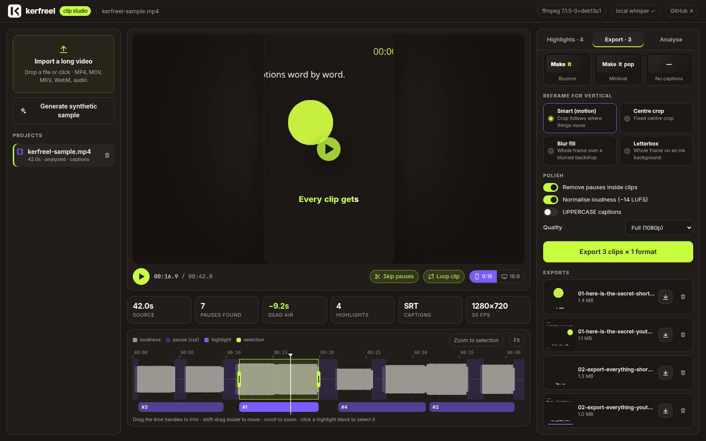
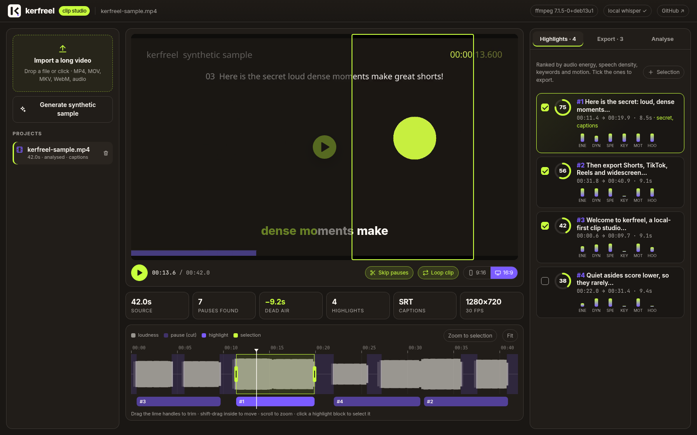
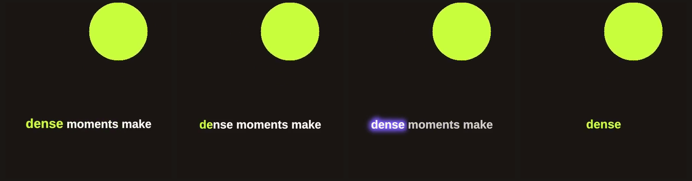
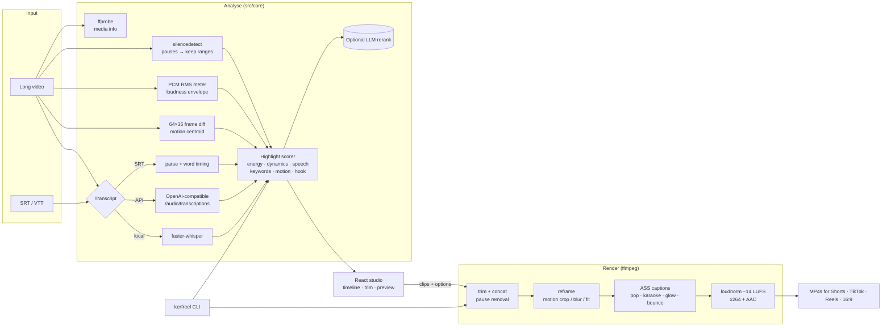

<div align="center">


# kerfreel

**Long video in. Scroll-stopping clips out.**

A local-first clip studio: it cuts the dead air, ranks the best moments, burns in animated word-by-word captions and batch-exports Shorts, TikToks, Reels and 16:9, all with ffmpeg on your own machine.

[](https://github.com/hbtabi/kerfreel/actions/workflows/ci.yml)
[](https://hbtabi.github.io/kerfreel/)
[](LICENSE)


[**Live demo**](https://hbtabi.github.io/kerfreel/) · [Quick start](#quick-start) · [CLI](#cli) · [How it works](#how-it-works) · [Roadmap](#roadmap)



</div>

## Why kerfreel

Streams, podcasts and vlogs are full of good 20–40 second moments hidden among long pauses. kerfreel finds those moments for you and gets them ready to post, with no cloud upload, account or watermark. Your footage never leaves your machine unless you choose an API for transcription.

## Features

| | |
|---|---|
| ✂️ **Pause removal** | ffmpeg `silencedetect` with adjustable threshold, minimum pause and "breathing room" padding. Short clicks are dropped, near cuts are merged and every cut gets a 12 ms audio fade so it never pops. Works on single clips or as a full-length jump-cut edit (`kerfreel cut`). |
| 🔥 **Highlight detection** | Candidate windows are aligned to speech and sentence boundaries, then scored on **loudness**, **dynamics**, **speech density** (talk coverage + words per second), **keywords** you choose, **motion** and **hook strength** (how hard the first 3 s hit). Non-max suppression keeps the picks distinct, and each one shows its score breakdown. |
| 🧠 **Optional LLM ranking** | Send the shortlisted transcripts to any OpenAI-compatible chat model to rerank them, write punchy titles and explain each pick. The result is blended with the heuristic score. |
| 💬 **Auto captions** | Use an **SRT/VTT** you already have (fully offline), **local whisper** (`faster-whisper` or `openai-whisper`) or any **OpenAI-compatible** `/audio/transcriptions` endpoint (OpenAI, Groq, LocalAI, a LiteLLM gateway…). Word timestamps are used when available and estimated from the cue text when not. |
| ✨ **Animated burned-in styles** | `pop` (active word turns lime and scales up), `karaoke` (smooth colour fill), `glow` (purple halo), `bounce` (words land one by one) and `minimal` (clean lower third). Rendered with libass and previewed live in the browser. |
| 📱 **Vertical reframing** | `motion` crop follows where things move with a smoothed virtual camera (frame-difference centroids, hysteresis and zero-phase smoothing), plus `center`, `blur-pad` (full frame over a blurred backdrop) and `fit` (letterbox on ink). |
| 🎚 **Platform presets** | YouTube Shorts, TikTok, Instagram Reels (1080×1920), YouTube 16:9 (1920×1080), Square 1:1 and Original. Loudness is normalised to −14 LUFS, and there are draft-quality renders for quick checks. |
| 🖥 **Timeline studio** | Loudness waveform with pauses shaded and highlights on their own lane. Drag handles to trim and shift-drag to move. Live **skip-pauses** preview, clip looping, a 9:16 preview that follows the planned crop and batch export with progress. |
| ⌨️ **CLI too** | `sample`, `analyze`, `clips`, `cut`, `captions`, `doctor`, `serve`, so you can script it, batch it or run it headless on a server. |
| 🧪 **No copyrighted fixtures** | A synthetic sample video (tone "speech", pauses and a moving subject on brand-coloured frames) is generated by ffmpeg for demos and tests. |

<table>
<tr>
<td width="50%"></td>
<td width="50%"></td>
</tr>
<tr>
<td align="center"><sub>Batch export: formats, caption styles, reframing and rendered clips</sub></td>
<td align="center"><sub>16:9 preview with the motion-following 9:16 crop guide</sub></td>
</tr>
</table>

<p align="center"><br/><sub>Real ffmpeg output: <code>pop</code>, <code>karaoke</code>, <code>glow</code> and <code>bounce</code></sub></p>

## Quick start

You need **Node.js ≥ 20.19** and **ffmpeg** (with libass, which most builds include).

```bash
# macOS: brew install ffmpeg · Ubuntu/Debian: sudo apt install ffmpeg · Windows: winget install ffmpeg
git clone https://github.com/hbtabi/kerfreel.git
cd kerfreel
npm install
npm run build
npm start                 # → http://127.0.0.1:5175
```

Click **Generate synthetic sample** to try the whole flow in a few seconds, or drop in your own long video.

For development (API with reload + Vite HMR on http://localhost:5173):

```bash
npm run dev
```

Optional extras:

```bash
cp .env.example .env              # add OPENAI_API_KEY / OPENAI_BASE_URL for API captions + LLM ranking
pip install faster-whisper        # local, offline transcription
node dist/cli/index.js doctor     # check what is available
```

## CLI

After `npm run build`, run `npm link` once to put `kerfreel` on your PATH (or call `node dist/cli/index.js` directly).

```bash
# Make a synthetic demo video + matching SRT (nothing copyrighted)
kerfreel sample demo.mp4

# Find highlights (writes demo.kerfreel.json)
kerfreel analyze demo.mp4 --srt demo.srt --keywords secret,giveaway --min 6 --target 10 --max 16

# One step: analyse and export the best 3 for Shorts, TikTok and 16:9 with pop captions and smart crop
kerfreel clips stream.mp4 --top 3 -f shorts,tiktok,youtube -s pop -r motion -o exports/

# Reuse an analysis, try another caption style, render a quick half-size draft
kerfreel clips stream.mp4 -a stream.kerfreel.json -s karaoke --scale 0.5

# Remove every pause from a whole video (jump cut), keeping the original frame
kerfreel cut lecture.mp4 -o lecture.tight.mp4

# Just convert subtitles into an animated .ass file
kerfreel captions talk.srt -s bounce --width 1080 --height 1920

# Start the studio
kerfreel serve --port 5175 --data ~/Videos/.kerfreel
```

Run `kerfreel <command> --help` to see every flag (silence threshold, padding, clip lengths, transcription provider, `--llm`, `--uppercase`, `--keep-pauses`, `--no-normalize` and more).

## How it works



- **Pure core, thin shells.** Range maths, highlight scoring, caption layout, ASS generation and crop planning live in `src/core/shared` with no Node or DOM imports. The browser preview runs the same code that drives ffmpeg, so what you see is what gets rendered.
- **One ffmpeg graph per clip.** Kept pieces are `trim`/`atrim`-ed (with micro-fades), concatenated, resampled to constant fps, then cropped (with a piecewise-linear `x(t)` expression for the motion camera) or padded, captioned with `ass` and loudness-normalised.
- **Flat-file projects.** The studio stores each project in `.kerfreel/projects/<id>/` (source, `analysis.json`, `captions.srt`, `exports/`). There is no database to set up.

```
src/
  core/shared/   pure logic (types, ranges/time-map, subtitles, caption layout, ASS, crop, highlights, presets)
  core/          ffmpeg wrappers, silence/energy/motion meters, transcription, LLM, render + export
  server/        Express API: upload, sample, analyse/export jobs, media streaming, static UI
  cli/           commander CLI
web/src/         React + Vite studio (timeline canvas, player, caption overlay, panels, demo API)
scripts/         dev runner, demo asset builder, local whisper helper
tests/           unit tests + ffmpeg integration tests (sample → analyse → export → HTTP API)
```

### Highlight score

Each candidate window `[start, end]` (clip length within your min/max, snapped to speech and sentence boundaries) gets features in 0–1:

| Feature | Signal |
|---|---|
| `loudness` | mean dBFS, normalised between the file's 10th and 95th percentile |
| `dynamics` | dB standard deviation, where bigger swings suggest emphasis or laughter |
| `speech` | share of the window that isn't pause, blended with words/sec when there is a transcript |
| `keywords` | hits of your keywords (or a small built-in hook lexicon) |
| `motion` | mean frame-difference energy |
| `hook` | loudness of the first 3 s, plus questions, exclamations and hook words in the opening |

`score = 100 · Σ wᵢ·fᵢ / Σ wᵢ` (unavailable features are left out of the sum), with a small penalty for windows that start mid-sentence. With `--llm`, the final score is `0.6 · heuristic + 0.4 · model`.

## Configuration

| Variable | Purpose | Default |
|---|---|---|
| `OPENAI_API_KEY` | enables API transcription and `--llm` reranking | unset |
| `OPENAI_BASE_URL` | any OpenAI-compatible endpoint | `https://api.openai.com/v1` |
| `KERFREEL_TRANSCRIBE_MODEL` / `KERFREEL_LLM_MODEL` | model names | `whisper-1` / `gpt-4o-mini` |
| `KERFREEL_WHISPER_MODEL` | local faster-whisper model | `base` |
| `KERFREEL_FFMPEG` / `KERFREEL_FFPROBE` | custom binaries | from `PATH` |
| `PORT`, `HOST`, `KERFREEL_DATA` | studio server | `5175`, `127.0.0.1`, `.kerfreel` |

The CLI reads a `.env` in the working directory automatically.

## Live demo

[hbtabi.github.io/kerfreel](https://hbtabi.github.io/kerfreel/) is the same UI built in **demo mode**. On every push, CI generates the synthetic sample, analyses it and pre-renders clips with the real ffmpeg pipeline. The page is read-only (no uploads or new renders), so run kerfreel locally for your own footage.

## Development

```bash
npm run lint         # ESLint (typescript-eslint + react-hooks)
npm run format:check # Prettier
npm run typecheck    # strict TS for engine, server, CLI, tests and web
npm test             # Vitest: unit tests + ffmpeg integration tests (skipped if ffmpeg is missing)
npm run build        # dist/ (node) + dist/web (UI)
npm run build:demo   # static demo bundle for GitHub Pages
```

CI runs all of the above on Node 20 and 22 with ffmpeg installed, plus a CLI smoke test that renders real clips.

## Roadmap

- [ ] Face-aware reframing (on-device face detection) alongside motion tracking
- [ ] Speaker diarisation and active-speaker crop for two-person podcasts
- [ ] Caption editor: fix words, emoji and colour per word, then re-render
- [ ] Hardware encoders (NVENC / VideoToolbox / QSV) and parallel renders
- [ ] Persistent job queue and resumable batch exports
- [ ] B-roll / zoom punch-ins on high-energy beats
- [ ] Export presets as files, and a watch-folder mode for automated pipelines
- [ ] Desktop bundle (Tauri) with ffmpeg included

## Honest limitations

- Highlight ranking is a **heuristic**. It favours loud, dense, energetic stretches, which suits streams and podcasts better than slow cinematic footage. Treat it as a strong first pass and trim from there.
- "Smart" reframing follows **motion, not faces**. A static talking head with a busy background can pull the crop sideways, so use `center` or `blur-pad` for those shots.
- When captions come from an SRT, **word timings are estimated** from cue timing and word length. Whisper word timestamps (local or API) are more precise.
- Renders run **one at a time** on the CPU (libx264 `veryfast`, no GPU encoding yet). On an 8-core box the synthetic sample renders at 1080×1920 faster than real time. Detailed real footage will be slower.
- The job queue lives in memory, so restarting the server forgets running jobs. Finished projects and exports stay on disk.
- The studio is meant to run on `127.0.0.1` for one user and has no authentication. Don't expose it to the internet as-is.
- Tested on Linux in CI and in development. macOS and Windows should work wherever ffmpeg and Node do, but have had less testing.

## Contributing

Issues and PRs are welcome. Please keep the core pure and tested: anything in `src/core/shared` must stay free of Node and DOM imports. Run `npm run lint && npm run typecheck && npm test` before opening a PR.

## License

[MIT](LICENSE) © 2026 Mohammed Hassan bin Tayyeb
